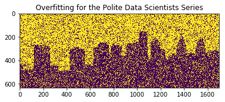

# LAN 2018 AI@Philadelphia
## Meetup Title
Demand Prediction Models and the Dangers of Overfitting

## Where
TBD

## When
Wednesday, September 26th

### Start Time
4:30 PM
### End Time
5:30 PM
## Description
Bike Sharing Demand was a demand prediction competition launched on Kaggle in 2016 with an interesting dataset from CapitalBikes. Many submit their models to win the awards and some made their script public after the submission deadline was over. For this year LAN Meetup kickoff we will discuss few winning models from the perspective of overfitting.
[The slides will be uploaded on here after the session.](https://github.com/lotusxai/LAN-Workshops)
[You can follow the discussion from the binder link here.](https://mybinder.org/v2/gh/lotusxai/LAN-Workshops/master?filepath=LAN2018Sept26%2FLAN2018SepBSharing.ipynb)

This presentation is from **Overfitting for the Polite Data Scientists** Series that combines the power of Kaggle and its publicly available Data and Kernels with the computing resources hosted by Amazon computing network knowns at AWS or Amazon Web Services. In each presentation, competing models sharing a common Data are being ran and their results are being discussed.

## For Who:
Either of the following groups should find the presentation useful and the networking made possible by our hosting partners valuable:

Audience from Technical backgrounds in Data Engineering, Statistics or Computer Science background will see few winning models from Kaggle compete.

Audience from Business, Sales, Marketing and Technical Recruiting background will experience of what it means to be "Data Oriented" while appreciating its worth and merits.

Finally, the future talents that are coming from a diverse background, technically or ethnically, and are willing to re-generate the results and learn by-doing. The codes will be made available here for your practice using LAN Github Repo and AWS resources. You won't need anything else besides the keen urge and wanting to learn and an AWS or Kaggle account. The reproduction costs are based on Free Tier units on AWS and completely free.
